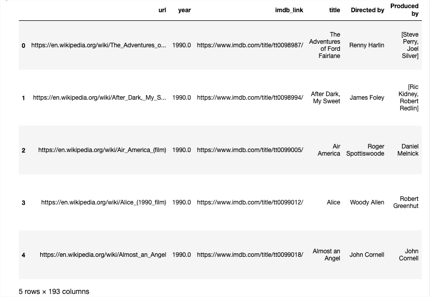
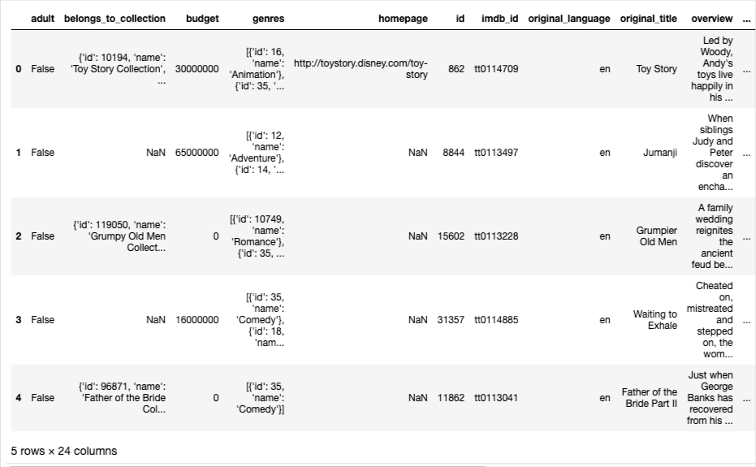
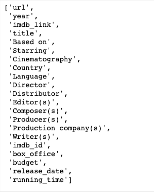

# Movies-ETL

## Content

### Deliverable 1: Write an ETL Function to Read Three Data Files

The ETL Function is

The outputs are

wiki_movies_df

kaggle_metadata

ratings

### Deliverable 2: Extract and Transform the Wikipedia Data

The code of the deliverable 2 is

The outputs are

wiki_movies_df_head

wiki_movies_df_colums_list

