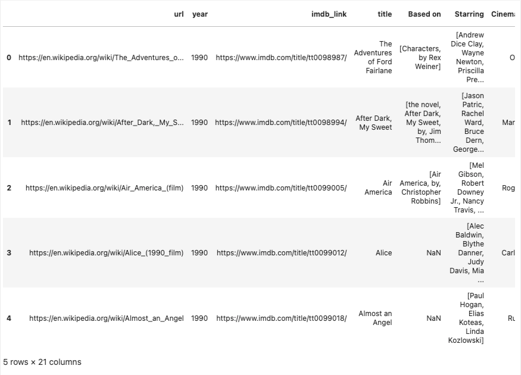

# Movies-ETL

## Content

### Deliverable 1: Write an ETL Function to Read Three Data Files

The ETL Function is

The outputs are

wiki_movies_df

kaggle_metadata

ratings

### Deliverable 2: Extract and Transform the Wikipedia Data

The code of the deliverable 2 is

The outputs are

wiki_movies_df_head

wiki_movies_df_colums_list

Notice that in the output given in the challenge the number columns is 23 but in my project it is 21.
In the challenge Budget and Release date columns were not dropped; so these columns are contained two times in the data frame, as old and new. I dropped old columns.

### Deliverable 3: Extract and Transform the Kaggle Data

The code of the deliverable 3 is

The outputs are

movies_with_ratings_df

movies_df

### Deliverable 4: Create the Movie Database

The code of the deliverable 4 is

The outputs are

movies_query

rating_query

elapsed_time

